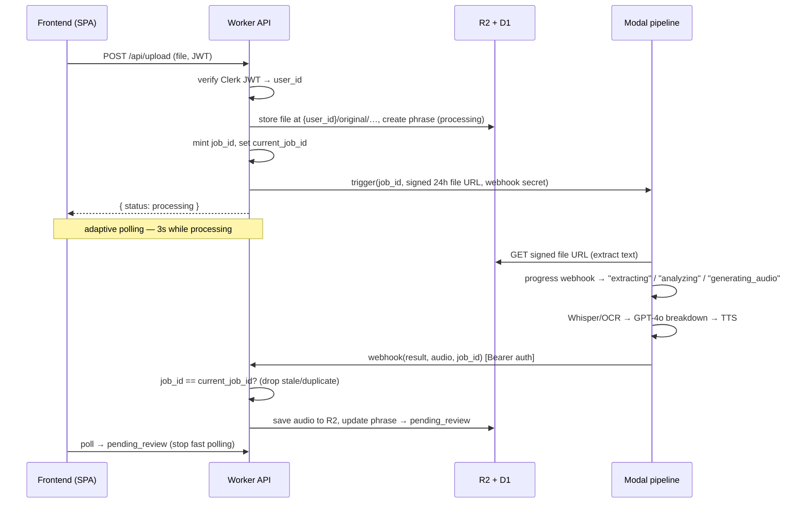

# Anki Capture — Case Study

**Context:** A solo full-stack build based on my personal language learning method of "harvesting" phrases and vocabulary in day to day life and native content, shipped and live at [ankicapture.com](https://ankicapture.com).
**Stack:** React + Cloudflare Workers/D1/R2 + Modal (Python AI pipeline) + GPT-4o/Whisper/Vision/TTS · **[Repo](https://github.com/gavinjzhang/anki-capture)** · **[Live demo](https://ankicapture.com)**

## The problem

Spaced-repetition flashcards (Anki) are one of the most effective ways to learn a language, but only if you actually make the cards, and good cards are tedious to build. For an inflecting language like Russian or Arabic, a single phrase is a small research task: type the text, find each word's dictionary form (root, infinitive, or triliteral root), note its case/gender/aspect, write a sentence-level grammar explanation, and attach native-speaker audio. Five minutes of study turns into twenty minutes of data entry, and most learners give up on the rich cards and settle for thin ones.

Anki Capture removes that friction. The learner provides the *least* effort input they have: a screenshot of a sign, a snippet of a podcast, a sentence they jotted down, and the app produces a complete, study-ready card. The goal was to make capturing a phrase as fast as taking a photo, so the learner stays in "learning" mode instead of "data entry" mode. As a traveller, real foreign language material was around me all the time, and Anki Capture was my way of tapping into it.

## My role

I designed and built the entire system end to end, solo:

- **The Cloudflare Worker API** — routing, Clerk JWT auth, the D1 data model, R2 storage, HMAC URL signing, AES-256-GCM encryption for user API keys, rate limiting, and the cron-based maintenance jobs.
- **The Modal AI pipeline** — the Python orchestration that chains Whisper, Google Vision OCR, GPT-4o, and TTS, plus the per-language configuration registry and the OCR text-filtering logic.
- **The React frontend** — upload/generate/review/export flows, the adaptive polling layer, and the auth wiring.
- **The async contract between them** — the webhook protocol, job-identity guarding, and progress reporting that ties the Worker and Modal together.

## Key technical decisions

### Serverless-only architecture (Cloudflare Workers + D1 + R2, plus Modal for compute)

- **Why:** This is a single-developer project with bursty, low-volume traffic and a hard constraint that it should cost almost nothing to run idle. Workers/D1/R2 scale to zero and sit comfortably in free tiers; there's no server to patch, no container to keep warm, no fixed monthly bill.
- **Alternatives considered:** A conventional Node/Express + Postgres app on a VM or a platform like Render/Fly. That would have given me a single language and a simpler mental model, but it means a server that's always on (and always billing) to serve a few requests a day, plus ops I didn't want to own.
- **The split:** Workers are a great API edge but a poor fit for GPU inference and heavy Python ML libraries (Whisper, the Google client SDKs). So compute lives on **Modal**, which gives on-demand GPU and a Python-native environment that also scales to zero. The Worker stays thin and fast; Modal does the slow, heavy work.
- **Tradeoff:** Two runtimes and two languages instead of one, and a network hop between them — which is exactly what forced the async design below. Worth it: the system costs near-zero at rest and each side uses the right tool for its job.

### Asynchronous webhook + polling instead of blocking requests or WebSockets

- **Why:** The pipeline takes 10–60 seconds (OCR/transcription → GPT-4o → TTS). Holding an HTTP request open that long is fragile and wastes Worker wall-time; it also can't survive the Worker↔Modal boundary cleanly.
- **The design:** The Worker creates the phrase record, fires a job at Modal, and returns immediately with `status: processing`. Modal does the work and calls back via an authenticated webhook with the result (and base64 audio, which the Worker persists to R2). The frontend reflects state with **adaptive polling** — 3s while a job is in flight, 30s when idle, paused when the tab is hidden, with an immediate poll after any user action.
- **Alternatives considered:** WebSockets or SSE via Cloudflare Durable Objects for "real-time" updates. I deliberately rejected this: it's the industry-standard pattern for *infrequent, single-user, long-running job status* (AWS CloudFormation polls on 30s; Vercel polls deploy status) and DOs would have added stateful infrastructure and billing for a problem polling solves for free.
- **Tradeoff:** Polling isn't instant and generates some idle requests — but with the adaptive intervals that cost is negligible, and the system stays stateless, debuggable, and free. (See the lifecycle diagram below for how identity-guarding makes the callback safe.)

## Architecture

The interesting part isn't the box diagram in the README — it's the **lifecycle of a single capture** and how it stays correct across an unreliable network boundary.

Three things in this flow carry most of the engineering judgment:

- **Identity, not just authentication, on the callback.** The webhook is Bearer-authenticated, but auth alone doesn't make it *correct*. Every job carries a `job_id` that's also stored as the phrase's `current_job_id`. A retry or a regenerate mints a new `job_id`, so when a stale or duplicated webhook arrives, the handler compares the two and silently ignores the mismatch. Progress events are also monotonic — an out-of-order "extracting" can't overwrite a later "analyzing".
- **Signed, time-boxed file access across the boundary.** Modal needs to read the user's original upload, but R2 isn't public. The Worker hands Modal a 24h HMAC-signed URL scoped to that one object; the UI gets 5–10 minute signed URLs for the same files. No standing credentials cross the wire.
- **A reconciliation loop for everything that escapes the happy path.** A cron runs every 15 minutes to move jobs stuck in `processing` past a timeout into `pending_review` with a recorded error, and to sweep R2 for objects no longer referenced by any D1 row (skipping very recent ones to avoid racing in-flight uploads). The system assumes the async path *will* sometimes fail and cleans up after itself.

## Challenges

**Making the async job lifecycle reliable was the real work.** The naive version — fire a job, wait for the webhook, update the row — breaks in all the ways distributed systems do: Modal's built-in retries can deliver a webhook twice; a user hits "retry" while the original job is still running and both eventually call back; a job dies silently and the phrase is stuck spinning forever. Each of these corrupts the user's data or hangs the UI. The fixes compounded into the design above: a per-job identity (`job_id`/`current_job_id`) so the Worker can authoritatively decide which callback "wins," monotonic progress steps so out-of-order delivery can't regress the UI, idempotent handling so duplicates are harmless, and a cron sweep as the backstop for jobs that never call back at all. I also had to keep *non-retryable* failures (a bad OpenAI key, exhausted quota) from being retried — those surface as clean, actionable messages instead of being hammered three times and serialized as an unreadable remote traceback.

**Auth and polling stability were a subtler, second front.** Clerk's JWTs are short-lived (≈60s), so the frontend has to refresh tokens transparently without races — I wired the token provider through a ref so the polling loop always reads current auth state instead of a stale closure, and JWKS keys are cached aggressively in the Worker (1h) so verification doesn't intermittently fail under load. On top of that, an early version of the adaptive polling fired API calls in rapid bursts; stabilizing the interval logic (and pausing on hidden tabs) was its own debugging pass. On the verification side, the Worker treats a *present-but-invalid* Bearer token as an immediate `401` — it never falls through to a weaker identity source — which closes an easy authorization hole.

## Results & impact

- **Shipped and live** at [ankicapture.com](https://ankicapture.com), serving real captures across **5 languages** (Russian, Arabic, Chinese, Spanish, Georgian) and **3 input modes** (image, audio, text) through one unified pipeline.
- **A capture-to-card time of ~10–60 seconds**, replacing what is otherwise several minutes of manual lookup, transcription, and audio-hunting per phrase.
- **Adding a language is a registry edit, not a rewrite.** A single `LANGUAGE_REGISTRY` entry defines OCR locales, Unicode script range, Whisper variants, TTS voice, and the GPT grammar prompt — so the per-language behavior stays consistent and new languages are cheap to add.
- **Built to be trusted with user data:** per-user isolation (every D1 query and R2 key namespaced by Clerk `user_id`), HMAC-signed file URLs, AES-256-GCM-encrypted bring-your-own API keys, Bearer-authed webhooks, and per-operation rate limiting.
- **~250 automated tests** across the Worker (auth, DB isolation, signing, routes), the frontend (API client, polling hook, components), and Playwright E2E with real Clerk auth — the auth and multi-tenant layers are covered deliberately because that's where a bug is most expensive.

## What I learned / what I'd do differently

The biggest lesson was that **the boundary between two scale-to-zero systems is where all the difficulty lives.** Each half is simple; the contract between them — identity, idempotency, timeouts, reconciliation — is where I spent most of the debugging time, and where I'd invest first on a similar project rather than treating it as an afterthought.

Things I'd change:

- **Rate limiting is in-memory per Worker instance**, which is fine for this scale but isn't a true global limit; I'd move it to Workers KV or Durable Objects before it mattered.
- **The export ZIP is assembled client-side** (the Worker returns data + signed URLs). That kept the Worker simple, but building the archive server-side would be cleaner for large decks.
- **`ALLOWED_ORIGINS` and a couple of config edges** evolved reactively (CORS fixes show up in the git history); I'd define the deployment surface up front next time rather than patching it after the fact.

None of these bite at the current scale — but naming them honestly is part of knowing the system.

---
*See the [README](README.md) to run the project.*
