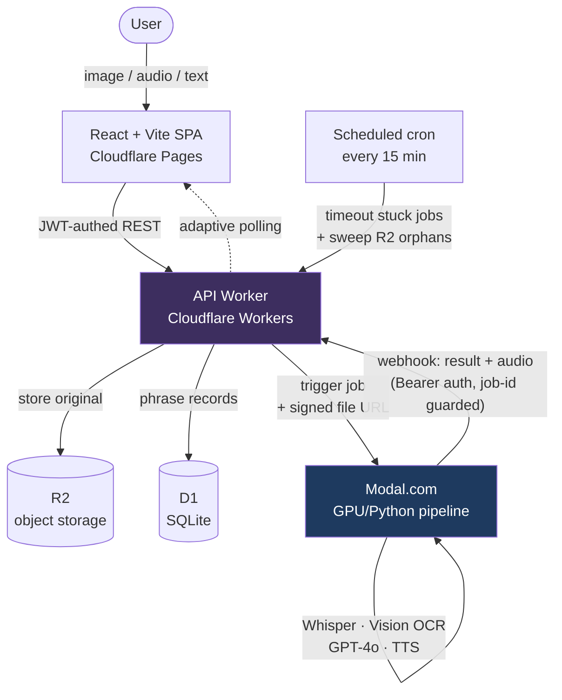

# Anki Capture

> Turn a screenshot, a voice memo, or a line of text in a foreign language into a complete Anki flashcard — translation, grammar, vocabulary, and audio — in under a minute.

Language learners waste hours hand-building flashcards: typing the phrase, looking up each word's root and case, writing grammar notes, finding audio. Anki Capture does all of it from a single input. Snap a photo of a sign, record yourself speaking, or paste a sentence; it extracts the text, runs an AI breakdown (sentence-level grammar + per-word roots/declensions), generates native-speaker TTS, and exports a ready-to-import Anki deck. Supports **Russian, Arabic, Chinese, Spanish, and Georgian**.

**[Live demo →](https://ankicapture.com)** · **[Case study →](CASE_STUDY.md)**

## Features

- **Three ways in** — upload an image (OCR), record/upload audio (speech-to-text), or type text directly.
- **AI grammar breakdown** — natural translation, transliteration, sentence-level grammar notes, and a per-word table with roots, gender, declension/conjugation, and usage notes, tuned per language.
- **Native-speaker audio** — TTS generated for image/text inputs (Google Cloud TTS, with an ElevenLabs fallback for languages Google doesn't cover).
- **Generate from a theme** — describe a topic ("ordering at a restaurant") and get a set of practice phrases, deduped against your existing deck.
- **Review before you commit** — every field is editable on a review screen; nothing reaches your deck unapproved.
- **One-click Anki export** — download a ZIP with a tab-delimited `phrases.txt` and an audio media folder.
- **Bring your own OpenAI key** — optional, stored encrypted (AES-256-GCM); the app falls back to a shared key otherwise.
- **Cards ready in ~10–60s** — fully asynchronous pipeline with live progress (extracting → analyzing → generating audio).

## Architecture



The **Worker** is the system's spine: it authenticates every request (Clerk JWT), owns all D1/R2 state, and hands long-running work to **Modal**, which runs the GPU and Python-heavy AI steps. Modal reports back through an authenticated, idempotent webhook rather than blocking the request, and the SPA reflects progress via adaptive polling. A scheduled cron reconciles anything that falls through the cracks — jobs stuck in `processing`, or orphaned files in R2.

See the [case study](CASE_STUDY.md) for the request lifecycle in detail and the reasoning behind these choices.

## Tech stack

- **Frontend:** React 18, Vite, TypeScript, Tailwind CSS, React Router, Clerk (auth) — deployed on Cloudflare Pages.
- **API:** Cloudflare Workers (TypeScript), D1 (SQLite), R2 (object storage), `jose` for JWT verification, Web Crypto for HMAC signing + AES-256-GCM.
- **AI pipeline:** Modal.com (Python 3.11) — OpenAI Whisper (transcription), Google Cloud Vision (OCR), GPT-4o (breakdown + phrase generation), Google Cloud TTS / ElevenLabs (audio).
- **Testing:** Vitest (`@cloudflare/vitest-pool-workers` for the Worker, jsdom for the frontend), Playwright + `@clerk/testing` for authenticated E2E.

## Getting started

### Prerequisites

- Node.js 18+, Python 3.11+
- A Cloudflare account (Workers, D1, R2, Pages) and a Modal account
- Google Cloud credentials (Vision + TTS) and an OpenAI API key
- A Clerk application for auth

### 1. API Worker

```bash
cd worker
npm install
npx wrangler login

# Create D1 + R2, then init the schema
npx wrangler d1 create anki-capture          # copy database_id into wrangler.toml
npx wrangler r2 bucket create anki-capture-files
npx wrangler r2 bucket create anki-capture-files-dev
npm run db:init

# Secrets (never commit these)
npx wrangler secret put MODAL_WEBHOOK_SECRET        # must match Modal's secret
npx wrangler secret put FILE_URL_SIGNING_SECRET     # openssl rand -base64 32
npx wrangler secret put USER_KEY_ENCRYPTION_SECRET  # for encrypting BYO API keys

npm run deploy
```

Set `CLERK_JWT_ISSUER` and `MODAL_ENDPOINT` in `wrangler.toml` (see the committed file for the shape).

### 2. Modal pipeline

```bash
cd modal
pip install modal && modal setup

modal secret create anki-capture-secrets \
  OPENAI_API_KEY=sk-... \
  GOOGLE_CREDENTIALS_JSON='{"type":"service_account",...}' \
  MODAL_WEBHOOK_SECRET=<same-as-worker> \
  ELEVENLABS_API_KEY=...   # optional, for Georgian and other non-Google-TTS languages

modal deploy app.py
# copy the trigger URL into the Worker's MODAL_ENDPOINT
```

### 3. Frontend

```bash
cd frontend
npm install
echo 'VITE_CLERK_PUBLISHABLE_KEY=pk_test_...' > .env.local
echo 'VITE_API_BASE=https://<your-worker>.workers.dev' >> .env.local   # or omit to use the Vite proxy
npm run dev        # http://localhost:5173
```

### Run the tests

```bash
cd worker && npm test      # Worker: auth, db, signing, routes
cd frontend && npm test    # Frontend: API client, polling hook, components
npx playwright test        # E2E (needs CLERK_PUBLISHABLE_KEY / CLERK_SECRET_KEY)
```

## Usage

1. **Upload** — pick image / audio / text on the Upload page (or use **Generate** to create phrases from a theme).
2. **Wait** — Modal processes the input in ~10–60s; the UI shows live progress.
3. **Review** — correct any field on the Review page, then approve.
4. **Export** — download the ZIP, copy `media/*` into Anki's `collection.media`, and import `phrases.txt` (fields: Front, Back, Grammar, Vocab, Audio, Transliteration).

## Project structure

```
worker/     Cloudflare Worker API — routing, auth, D1/R2 access, signing, cron maintenance
  src/routes/      upload · generate · phrases · export · webhook · files · settings
  src/lib/         auth (Clerk JWT) · db · r2 · signing (HMAC) · crypto (AES-GCM) · rateLimit
modal/      Python AI pipeline — Whisper, Vision OCR, GPT-4o breakdown, TTS, language registry
frontend/   React SPA — Upload, Generate, Review, Library, Export, Settings + adaptive polling
e2e/        Playwright tests with Clerk auth
```

MIT
